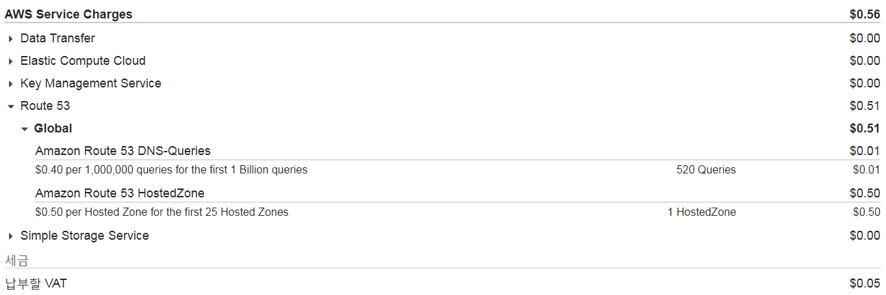
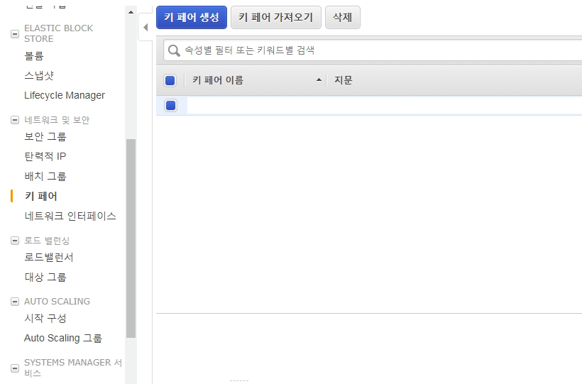
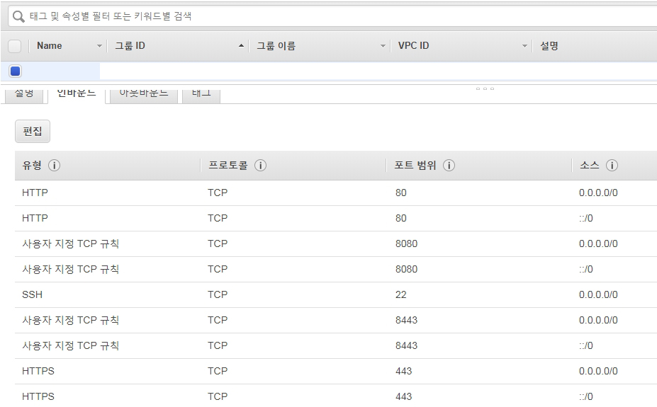

프로젝트 호스팅 할 겸, AWS 연습해 볼 겸 **AWS**로 **EC2**를 발급받고 **Let's encrypt** 보안서 발급까지 마쳤다.

### 요금발생

모두 끝마친 뒤에 열어본 요금 청구서.  
호스트명 등록 0.5\$와 DNS 쿼리 요금, 그리고 세금까지 `0.56$` 많은 돈은 아니지만 조금이라도 쓰기 싫은 사람은 let's encrypt를 통해서 보안서를 발급받는 건 포기해야한다. 다른 곳은 모르겠는데 let's encrypt는 아이피 형식으로 된 도메인 주소를 거부하기 때문에 호스트명이 필수다.  
DNS 쿼리 요금은 사이트에 접속할 때 DNS와 연결된 IP주소를 찾는 횟수에 따라 청구된다. 이틀간 시행착오를 겪으면서 많이 왔다갔다 했더니 0.01\$가 나왔다. 개인 프로젝트 사이트라 요금걱정은 없지만 보안이 취약할테니 웹상에 공개해서 이상한 사람한테 쿼리 테러 당하는 일이 없도록 하자..

---

### 아마존 웹서비스 AWS

**AWS**는 아마존에서 만든 **클라우드 컴퓨팅 서비스**이다. 현재 **하나의 인스턴스**를 1년동안 **무료**로 사용할 수 있다. 만약에 2개 이상의 인스턴스를 만들면 12개월에서 인스턴스의 수만큼 나눈다. 실사용시에도 타 서비스보다 저렴하다곤 하던데 나는 단지 개인적으로 프로젝트에 HTTPS연결을 해보기 위해 사용했다.

#### Key pair

회원가입을 마친 뒤에 **ec2 대시보드**에 진입해 **키페어**를 생성한다. 가끔 이 키페어를 그대로 github에 올려서 다른 사람의 성장에 이바지 하는 사람이 있다. 키페어는 반드시 개인 PC혹은 USB에 저장해야한다.

#### 인스턴스 시작

다시 **ec2 대시보드**에 진입해서 메인에 바로 보이는 `인스턴스 시작` 버튼을 클릭, `Ubuntu Server 16.04 LTS (HVM), SSD Volume Type` 로 시작  
용량 선택은 Free 표시가 있는 걸로 선택하고 나머지는 그대로 넘긴다.

#### elastic ip 생성

**ec2 대시보드** 우측 `메뉴 - 네트워크 및 보안 - 탄력적 IP 혹은 elastic ip`를 눌러서 생성한다. 이 ip 주소가 사이트 주소가 된다.  
생성 후 `작업/Action - 주소연결/allocate..` 유일한 인스턴스와 연결한다.

#### 포트 허용

다시 `네트워크 및 보안탭 - 보안 그룹`에 진입해, defult가 아닌 아이디를 선택하고, `인바운드 - 편집`에서 80, 8080, 443, 8443 포트를 추가해준다.  
하나만 추가하면 자동으로 두개씩 만들어진다.

#### PUTTY를 통한 ubuntu 연결

공식 다운로드 페이지가 없다. 구글에 검색해서 putty 패키지를 다운받아 putty gen과 putty가 있는지 확인.

**PuTTYgen** `Load` `All files` 선택 후 아마존 keypair 선택 `RSA, 2048` - `Save private key` _ppk파일 생성_  
이 ppk파일을 통해 아마존 서버에 들어갈 수 있다.  
**PuTTY** `HostName` : elastic ip `Connection Type` : SSH  
`Connection-SSH-Auth` 탭에서 `Browse..` PuTTYgen으로 생성한 _ppk파일_ 선택  
`session`탭에서 `Save`를 누르면 설정을 저장할 수 있지만 ppk파일은 접속할 때마다 불러와야 한다.

엔터 후 Welcome to ubuntu~ 가 뜨면 접속 성공
