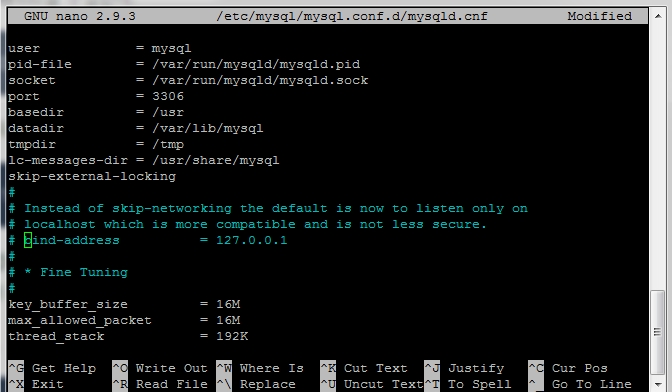
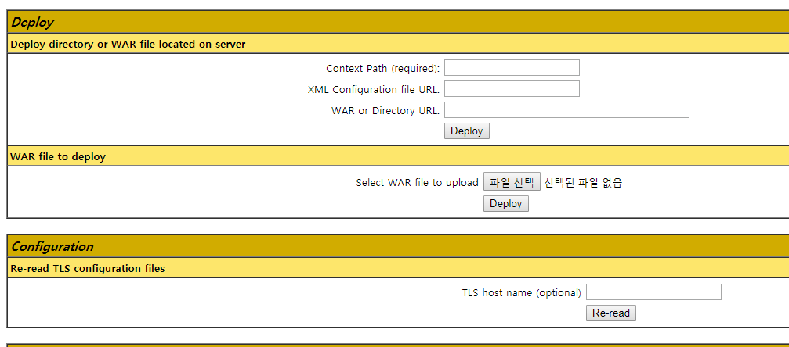

JAVA와 톰캣8 설치는 [여기](https://devops.profitbricks.com/tutorials/how-to-install-and-configure-tomcat-8-on-ubuntu-1604/)를 참고해서 상황에 맞게 변경했다.

우선 `sudo su` root로 로그인한다. root로 로그인 하면 `sudo` 없이 명령문을 실행할 수 있다. 입력은 선택.

```bash
apt-get update
apt-get upgrade
dpkg-reconfigure tzdata // Asia - Seoul
```

### JAVA 설치

`apt-get update`는 `install`을 하기 전마다 실행해준다.

```bash
sudo apt-get update
sudo apt-get install default-jdk
```

jdk설치 완료. 다음을 통해 자바 버전을 확인한다.

```console
java -version

openjdk version "10.0.2" 2018-07-17
OpenJDK Runtime Environment (build 10.0.2+13-Ubuntu-1ubuntu0.18.04.2)
OpenJDK 64-Bit Server VM (build 10.0.2+13-Ubuntu-1ubuntu0.18.04.2, mixed mode)
```

### Tomcat8 설치

톰캣 설치 또한 `apt-get install tomcat8`을 이용할 수도 있으나 처음에 이렇게 설치했더니 톰캣이 여러 경로에 퍼지고, 수정·삭제시에도 몹시 귀찮아 `wget`을 이용해 설치하려 한다.

먼저 톰캣 그룹를 생성한다.

```console
sudo groupadd tomcat
sudo useradd -s /bin/false -g tomcat -d /opt/tomcat tomcat
```

셸 권한이 없도록 `-s /bin/false`옵션을 추가하고 tomcat 그룹에 새 유저 tomcat를 추가한다. `/opt/tomcatp`은 현재는 존재하지 않지만 톰캣을 설치할 홈 경로이다.

톰캣8을 설치파일 다운로드

```console
cd ~
wget http://apache.tt.co.kr/tomcat/tomcat-8/v8.5.34/bin/apache-tomcat-8.5.34.tar.gz
```

뒤의 주소는 [톰캣8 다운로드 페이지](http://tomcat.apache.org/download-80.cgi)에서 `Core : tar.gz`의 링크주소이다. 그래서 지금은 8.5.34 버전을 이용하지만 버전이 업그레이드 되면 다운로드 페이지에서 다시 링크주소를 복사해야한다.

압축해제

```console
sudo tar -xzvf apache-tomcat-8.5.34.tar.gz
sudo mv apache-tomcat-8.5.34 /opt/tomcat
```

좀전에 만들어 둔 tomcat유저에게 이 폴더의 권리를 준다.

```
sudo chgrp -R tomcat /opt/tomcat
sudo chown -R tomcat /opt/tomcat
sudo chmod -R 755 /opt/tomcat
```

#### tomcat service 등록

tomcat을 서비스로 사용하기 위해서 새로운 service파일을 생성한다. 그전에 먼저 설치해 둔 java 경로를 조회해야한다.

```console
sudo update-alternatives --config java

There is only one alternative in link group java (providing /usr/bin/java):
/usr/lib/jvm/java-11-openjdk-amd64/bin/java
Nothing to configure.

```

여기에서 조회한 자바 경로를 `/bin/java`를 제외하고 아래 서비스 파일에 넣어줄 것이다.

```console
sudo nano /etc/systemd/system/tomcat.service
```

새로 생성했기 때문에 기본 내용은 공백이다. 작성할 내용은 다음과 같다.

```bash
    [Unit]
    Description=Apache Tomcat Web Server
    After=network.target

    [Service]
    Type=forking

    Environment=JAVA_HOME=/usr/lib/jvm/java-11-openjdk-amd64
    Environment=CATALINA_PID=/opt/tomcat/temp/tomcat.pid
    Environment=CATALINA_HOME=/opt/tomcat
    Environment=CATALINA_BASE=/opt/tomcat
    Environment='CATALINA_OPTS=-Xms512M -Xmx1024M -server -XX:+UseParallelGC'
    Environment='JAVA_OPTS=-Djava.awt.headless=true -Djava.security.egd=file:/dev/./urandom'

    ExecStart=/opt/tomcat/bin/startup.sh
    ExecStop=/opt/tomcat/bin/shutdown.sh

    User=tomcat
    Group=tomcat
    UMask=0007
    RestartSec=15
    Restart=always

    [Install]
    WantedBy=multi-user.target
```

`nano`는 `ctrl+w - enter - crtl+x` 로 저장 및 종료할 수 있다.
설정을 갱신하기 위해

```console
sudo systemctl daemon-reload
```

이제 systemsctl 명령어를 통해 톰캣을 제어할 수 있다.

```console
sudo systemctl start tomcat
sudo systemctl status tomcat

● tomcat.service - Apache Tomcat Web Server
   Loaded: loaded (/etc/systemd/system/tomcat.service; enabled; vendor preset: e
   Active: active (running) since Mon 2018-09-17 09:17:00 +09; 1 day 1h ago
  Process: 14512 ExecStop=/opt/tomcat/bin/shutdown.sh (code=exited, status=0/SUC
  Process: 14542 ExecStart=/opt/tomcat/bin/startup.sh (code=exited, status=0/SUC
 Main PID: 14553 (java)
    Tasks: 58 (limit: 1170)
   CGroup: /system.slice/tomcat.service
           └─14553 /usr/lib/jvm/java-11-openjdk-amd64/bin/java -Djava.util.loggi
```

`active(running)` 이 나와야한다!  
톰캣 서비스를 지속적으로 사용하기 위해

```console
sudo systemctl enable tomcat
```

그리고 방화벽 ufw에 톰캣이 사용하는 8080을 허락해 준 뒤

```console
sudo ufw allow 8080
```

`http://elastic-ip:8080` 으로 접속해본다. 톰캣 화면이 뜨면 성공

### 톰캣 매니저

톰캣 매니저 페이지를 통해 깔끔하게 war파일을 업로드할 것이다. 그러기위해 `tomcat-users.xml`파일을 수정할 필요가 있다.

```
sudo nano /opt/tomcat/conf/tomcat-users.xml
```

아래의 내용을 추가한다.

```xml
<role rolename="manager-gui"/>
<role rolename="admin-gui"/>
<user username="유저네임" password="비밀번호" roles="manager-gui,admin-gui"/>
```

그리고 `context.xml`파일에서 ip접속을 수정한다.

```bash
sudo nano /opt/tomcat/webapps/manager/META-INF/context.xml

allow="내\.집\.아이\.피|127\.\d+\.\d+\.\d+|::1|0:0:0:0:0:0:0:1" />

//만약 모든 아이피를 허용하려면 allow=".*"

sudo nano /opt/tomcat/webapps/host-manager/META-INF/context.xml

allow="내\.집\.아이\.피|127\.\d+\.\d+\.\d+|::1|0:0:0:0:0:0:0:1" />
```

모두 수정했으면 `sudo systemctl restart tomcat` 톰캣을 재시작한다.

---

### MySQL 설치

설정 당시 요금이 두려워서 인스턴스에 설치했는데 무료 인스턴스에 설치했더니 계속 계속 메모리가 초과되어서 결국 삭제했다. 참고용

```console
sudo apt-get install mysql-server
sudo apt-get install mysql-client
```

`mysql -V` 버전 확인

언어 설정을 위해 다음 내용을 추가한다.

```bash
nano /etc/mysql/mysql.conf.d/mysqld.cnf

character-set-server = utf8mb4
collation-server = utf8mb4_unicode_ci
```

JDBC 드라이버 설치

```console
apt-get install libmysql-java
```

`/usr/share/java/mysql-connector-java.jar` 위치에 설치된다.

소프트링크 연결

```console
ln -s /usr/share/java/mysql-connector-java.jar /opt/tomcat/lib/mysql-connector-java.jar

sudo systemctl restart tomcat
```

DB는 순수하게 ubuntu에서 생성할 수도 있고, 윈도우에서 원격으로 접속할 수도 있고, dump파일을 파일질라로 복사할 수도 있다. 여기선 원격 접속만 설명하겠다.

#### MySQL 원격 접속

먼저 ubuntu에서 **mysql**에 접속해 **user**를 생성하고 권한을 부여한다.

```sql
mysql -u root -p
use mysql
create user 'username'@'%' identified by 'passwd'
```

그리고 **mysql** cnf파일에서 접근제어를 풀어줘야 한다. cnf파일은 `/etc/mysql/my.cnf`에 있는데 나는 이 파일이 `/etc/mysql/mysql.conf.d/mysqld.cnf`을 참조하는 형태였기 때문에 후자를 수정했다.

```console
sudo nano /etc/mysql/mysql.conf.d/mysqld.cnf
```

  
위 사진과 같이 `bind-address`를 주석처리한다.

그 후 3306의 접근을 열어주고,

```console
iptables -t filter -A OUTPUT -p tcp --dport 3306 -j ACCEPT
iptables -t filter -A INPUT -p tcp --sport 3306 -m conntrack --ctstate ESTABLISHED -j ACCEPT
```

ec2 보안그룹에서 `MYSQL/Aurora - 위치무관` 을 추가한다.  
window cmd창을 열고

```bash
mysql -h elastic-ip -u username -p
```

비밀번호 입력 후 mysql이 뜨면 성공

만약 파일질라를 통해 dump파일을 옮기면 권한문제가 생길 수 있는데, `chown -R ubuntu /경로` 와 `chmod -R 777 /경로`를 통해 해결한다.

---

### war파일 배포

프로젝트 혹은 톰캣 폴더의 `context.xml`가 상황에 맞게 설정되었는지 확인하고 export한다.

배포를 위해 `http://elastic-ip/manager/html` 매니저 페이지로 진입. `tomcat-users.xml`에서 등록한 이름과 비밀번호를 통해 로그인 한다.



war파일 등록. 이제 `http://elastic-ip:8080/프로젝트이름`을 통해 프로젝트를 확인할 수 있다.
